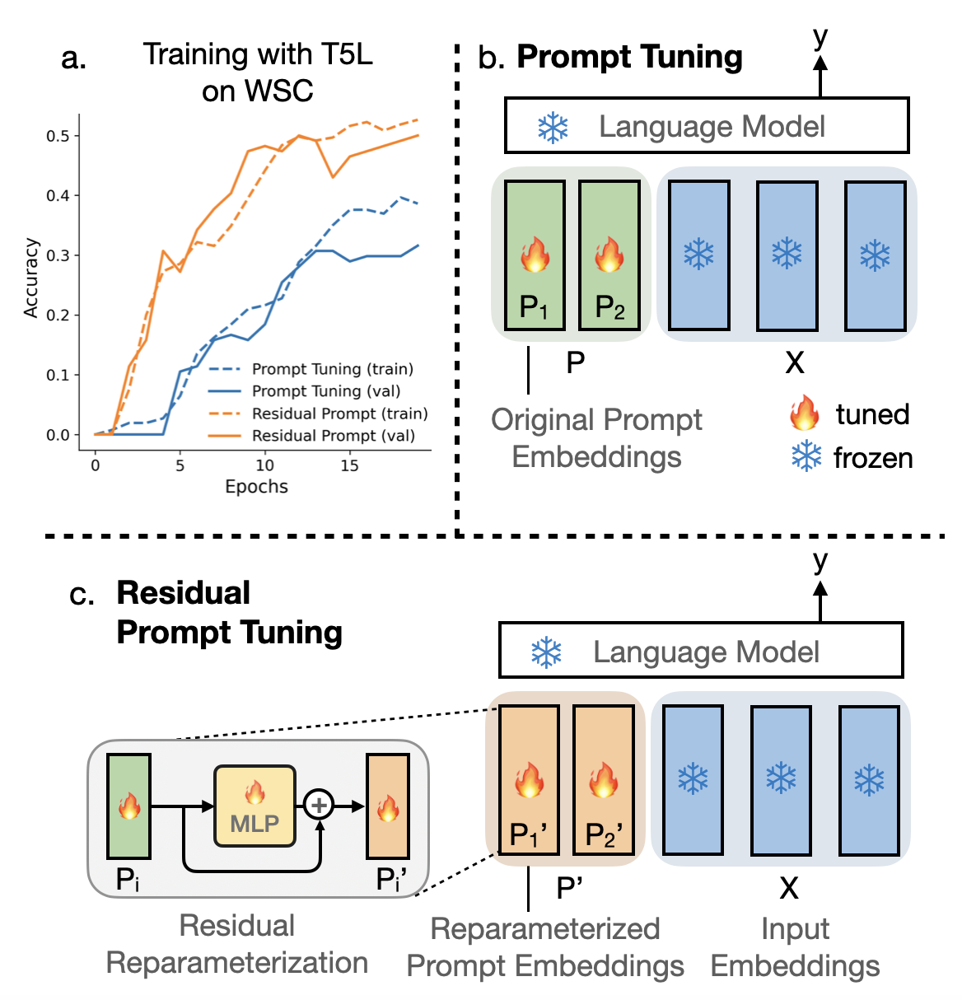

# Residual Prompt Tuning
<!--  -->

**Illustration of Residual Prompt Tuning and comparison with prompt tuning by Lester et al. (2021). **

This repository contains the original implementation for "Residual Prompt Tuning: Improving Prompt Tuning with Residual Reparameterization" (ACL 2023) by Anastasia Razdaibiedina, Yuning Mao, Rui Hou, Madian Khabsa, Mike Lewis, Jimmy Ba and Amjad Almahairi.

**Our work is accepted to ACL Findings 2023!**


Our paper here - ["Residual Prompt Tuning: Improving Prompt Tuning
with Residual Reparameterization"](https://arxiv.org/abs/2301.12314), ICLR 2023.


We include codebase for:
* regular prompt tuning (following Lester et al.)
* residual prompt tuning (our modification)
* full model tuning

<!-- To create nlp virtual env., run:
conda env create -f environment.yaml -->
## Installation
```bash
git clone https://github.com/arazd/soft_prompts
cd ResidualPrompts
conda env create -f environment.yaml
conda activate nlp
```

## Training
An example of training a 10-token soft prompt on WSC task using T5-base model and residual reparametrization with MLP1 type:
```bash
python train.py --task wsc --prefix_MLP MLP1 \
    --lr 0.3 --freeze_weights 1 --freeze_except xxxx \
    --model_name t5-base --early_stopping 1 \
    --test_eval_after_every_task 1 --select_k_per_class -1 \
    --batch_size 8 --num_epochs 20 --prefix_len 10 \
    --save_dir /home/%u/my_dir/ --save_name my_model_folder
```

## Repo structure
